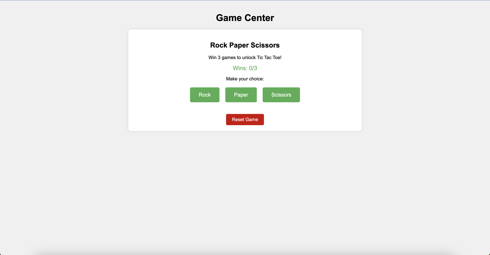

# Rock Paper Scissors Game

A simple web-based Rock Paper Scissors game built with Python and Flask.



## Setup Instructions

1. Make sure you have Python installed on your computer.

2. Install the required dependencies:
```bash
pip install -r requirements.txt
```

3. Run the application:
```bash
python app.py
```

4. Open your web browser and go to: `http://localhost:5000`

## How to Play

1. Click on one of the three buttons (Rock, Paper, or Scissors) to make your choice
2. The computer will randomly select its choice
3. The result will be displayed showing who won the round

## Game Rules

- Rock beats Scissors
- Scissors beats Paper
- Paper beats Rock
- If both players choose the same option, it's a tie 

## Learning Outcomes

As a Python beginner, this project helps you learn several important programming concepts:

1. **Basic Python Syntax**
   - Function definitions and calls
   - Conditional statements (if-else)
   - Variables and data types

2. **Web Development with Flask**
   - Understanding web frameworks
   - Handling HTTP requests
   - Basic routing concepts

3. **Logic and Decision Making**
   - Implementing game rules through code
   - Using comparison operators
   - Working with conditional logic

4. **Random Number Generation**
   - Using Python's random module
   - Understanding randomization in games

5. **User Input Handling**
   - Processing user choices
   - Input validation
   - Providing user feedback

6. **Basic HTML/Web Integration**
   - Connecting Python with web interfaces
   - Understanding client-server communication

This project serves as a practical introduction to building interactive applications while learning fundamental programming concepts.

